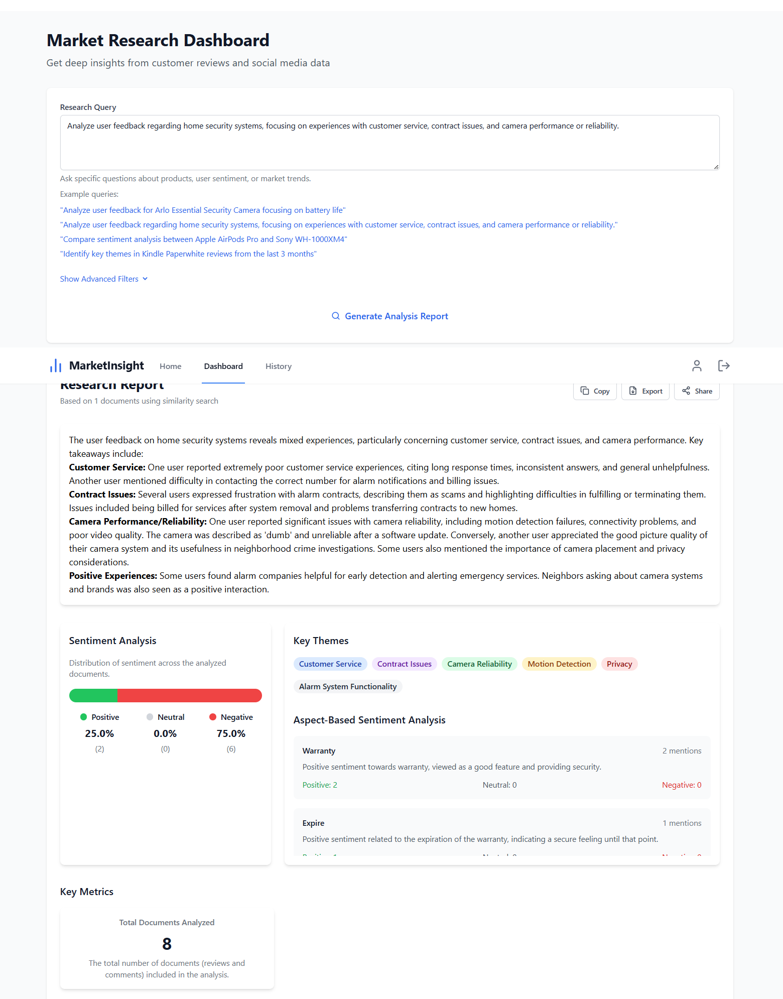
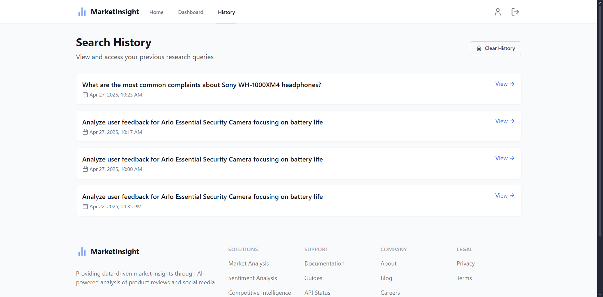
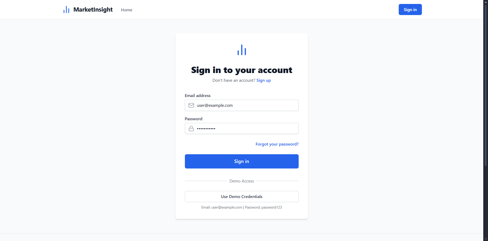

# Market Insight AI: RAG-Based Market Analyzer

Market Insight AI is an end-to-end AI-driven tool designed to help users extract valuable insights from the web about a given product. It leverages web scraping, NLP-based preprocessing, sentiment analysis, entity recognition, topic modeling, and a powerful RAG (Retrieval-Augmented Generation) pipeline integrated with Google’s Generative AI to generate concise and informative reports.


[VIDEO DEMO](https://drive.google.com/file/d/12H-9aLjTp0yeGsmuI4jTxzfNB5DTjgwr/view?usp=sharing)

***

## 📁 Project Structure :
```
├── backend/
│   ├── RAG/
│   │   ├── chroma_db_market_research/
│   │   ├── config.py
│   │   ├── prompt_formatter.py
│   │   ├── RAG_components.py
│   │   ├── rag_data_loader.py
│   │   ├── rag_test.py
│   │   └── retrieval_methods.py
│   ├── .env
│   ├── .gitignore
│   └── app.py
├── data/
├── data_collection/
│   ├── .env            # store REDDIT API KEY
│   ├── configureneral.py
│   ├── main.py
│   ├── reddit.py
├── data_processing/
│   ├── aspect_sentiment_analyzer.py
│   ├── data_processor.py
│   ├── entity_extractor.py
│   ├── main.py
│   ├── product_mention_analyzer.py
│   ├── sentiment_analyzer.py
│   └── text_cleaner.py
├── frontend/
│   ├── node_modules/
│   ├── src/
├── processed_output/
```
## Project Overview :
1. [Features](#features-)
2. [Project setup](#project-setup-)
3. [Data Pipeline](#data-processing-pipeline-)
4. [Retrieval Methods](#retrieval-methods)
5. [Screenshots](#screenshots)


## Features :

-  Web scraping pipeline using BeautifulSoup (Amazon product reviews) and Reddit data 
-  NLP processing: cleaning, sentiment analysis, aspect-based sentiment, entity recognition, topic modeling
-  Vector storage using ChromaDB with multiple retrieval strategies
-  RAG chain built with LangChain and Gemini LLM
-  Report generation and user history tracking via a RESTful Flask API
-  User-friendly frontend (React-based) to interact with the system and view reports

## Project setup :
1. Clone repository :
    ```bash
    git clone https://github.com/AhmedTrb/RAG-Agent-for-Market-Research
    cd RAG-Agent-for-Market-Research
    ```
2. Add Google gemini-2.0-flash API key in the .env file 
in backend/RAG from [Google AI for developers](https://ai.google.dev/gemini-api/docs/api-key)
    ```
    GOOGLE_API_KEY=<your api key>
    ```

3. Run frontend
    ```bash
    cd frontend
    npm i
    npm run dev
    ```

4. Run the backend
    ```bash
    cd backend 
    pip install -r requirements.txt
    flask run
    ```

## Data Processing Pipeline :
The data pipeline transforms raw web text into enriched, query‑ready embeddings stored in ChromaDB. It consists of:

### 1. Data Loading
- Load raw JSON files of reviews, posts, and comments into memory.
### 2. Text Cleaning
- Removal of noise Normalization, tokenization, lemmatization Stop‑word removal

### 3. Document‑Level Analysis
- Sentiment Analysis (VADER): Overall polarity (positive, neutral, negative) and compound score
- Aspect‑Based Sentiment (ABSA): Identify aspects (e.g., battery life) and score sentiment per aspect via spaCy + VADER
- Named‑Entity Recognition (NER): Extract products, brands, organizations using spaCy

### 4. Corpus‑Level Analysis

- TF‑IDF: Compute term importance across the corpus with scikit‑learn’s TfidfVectorizer
- LDA Topic Modeling: Discover latent themes using LatentDirichletAllocation

### 5. Vectorization & Storage

- Generate embeddings for each cleaned document using Google Generative AI Embedding
- Serialize metadata (sentiments, aspects, entities, topics) into JSON
- Store embeddings and metadata in ChromaDB for fast retrieval


## Retrieval Methods
Different retrieval strategies let you tailor which documents feed into the RAG chain. Two important filters focus on sentiment:

### Semantic Similarity Search
- **How it’s used**:  
  Compute the embedding of the user’s query, then retrieve the documents whose embeddings have the highest cosine similarity to that query embedding.  
- **Goal**:  
  Provide a broad, contextually relevant overview by surfacing the most semantically related content.

---

### Positive Sentiment Filter
- **How it’s used**:  
  1. Perform a semantic similarity search to get top‑n candidate documents.  
  2. Filter that result set to only include documents with `sentiment_label = "positive"`.  
- **Goal**:  
  Highlight strengths, best feedback, and success stories about a product or service.

---

### Negative Sentiment Filter
- **How it’s used**:  
  1. Perform a semantic similarity search to get top‑n candidate documents.  
  2. Filter that result set to only include documents with `sentiment_label = "negative"`.  
- **Goal**:  
  Surface complaints, pain points, and potential risks so businesses can address issues proactively.


## Screenshots 

**Landing Page :**


**Dashboard Report:**


**History :**


**Authentication :**

